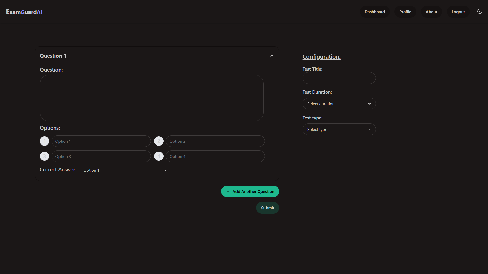

#  ExamGuardAI

> **Secure AI-powered in-browser proctoring system** using MediaPipe FaceMesh and WebAssembly (WASM).

---

## 📌 Overview

**ExamGuardAI** is a modern, privacy-respecting browser-based proctoring tool designed to monitor students during online examinations. Unlike traditional systems that stream video to servers, ExamGuardAI uses **MediaPipe FaceMesh** with **WebAssembly** to run real-time facial analysis directly in the browser.

This ensures a lightweight, scalable, and secure way to detect suspicious behaviors like looking away, face absence, or keyboard violations — all without video uploads.

---

## > Key Features

* 👁️ **Eye Gaze Tracking**

  * Detects when the student looks away from the screen
* 🧝 **Head Pose Detection**

  * Detects head tilt in up, down, left, or right directions
* 🙈 **Face Absence Detection**

  * Flags when the student leaves the frame
* ⌨️ **Keyboard Violation Monitoring**

  * Detects copy/paste, fullscreen exit, context menu, and Alt+Tab
* 🌐 **Fully Browser-Based**

  * No external extensions or downloads required
* 📉 **Admin Dashboard**

  * Shows exam status and all logged violations
* 💡 **Privacy-first Design**

  * Nothing is stored or streamed; only metadata is sent to backend
 
* 🧑‍🏫 **Dynamic Role-Based Access**
  * Seamlessly separates Instructor and Student views with tailored permissions and UI


---
## Screenshots
<h3>▶ Home Page</h3>
<h5>The landing screen where users begin their ExamGuardAI journey.</h5>
<p align="center">  </p>

<h3>▶ Select Test Type</h3>
<h5>Students or instructors can choose between MCQ or Assignment-style test formats.</h5>
<p align="center">  </p>

<h3>▶ Create Assignment Test</h3>
<h5>Interface for teachers to set up assignment-based questions.</h5>
<p align="center">  </p>

<h3>▶ Create MCQ Test</h3>
<h5>Teachers can create multiple-choice questions with correct answers.</h5>
<p align="center">  </p>

<h3>▶ Join Test via Link</h3>
<h5>Students paste a test link to enter the examination.</h5>
<p align="center">  </p>

<h3>▶ Join Page</h3>
<h5>Allows candidates to authenticate and begin the test.</h5>
<p align="center">  </p>

<h3>▶ Instruction Page</h3>
<h5>Briefs users on test environment rules and permissions.</h5>
<p align="center">  </p>

<h3>▶ Assignment Test (Student View)</h3>
<h5>Submission area for writing answers during assignment-based exams.</h5>
<p align="center">  </p>

<h3>▶ MCQ Test (Student View)</h3>
<h5>Live MCQ session with options, timer, navigation, and end exam button.</h5>
<p align="center">  </p>

<h3>▶ Admin Dashboard</h3>
<h5>Live dashboard showing who is attempting, who completed, and their violations.</h5>
<p align="center">  </p>

<h3>▶ About Page</h3>
<h5>Describes ExamGuardAI’s mission, features, and design philosophy.</h5>
<p align="center">  </p>

---

## > Powered by MediaPipe FaceMesh 

### 🔍 What is MediaPipe?

**MediaPipe** is an open-source framework by **Google** for building real-time perception pipelines. It powers advanced machine learning tasks like pose estimation, face tracking, and gesture recognition across platforms like mobile, desktop, and the web.

In **ExamGuardAI**, we use MediaPipe for **facial analysis** — specifically through the **FaceMesh** model — entirely within the browser.

---

### 🧠 What is FaceMesh?

**MediaPipe FaceMesh** is a real-time face landmark model that detects **468 3D facial landmarks** from a single webcam feed. It's highly optimized for performance and accuracy.

We use FaceMesh to:

* 📐 **Estimate Head Pose** — via pitch/yaw from eye, nose, and forehead landmarks
* 👁️ **Track Eye Gaze Direction** — by monitoring iris and eyelid orientation
* 🙈 **Detect Face Absence** — when facial landmarks disappear from the frame

All of this works directly in-browser without sending video to the server.

---

### 🧩 Why WebAssembly (WASM)?

**WebAssembly (WASM)** is a fast, browser-native runtime that lets us run machine learning inference without heavy dependencies.

Benefits in ExamGuardAI:

* ⚡ **Real-Time**: Smooth, responsive landmark tracking even on low-end devices
* 🔐 **Privacy-First**: No video or raw images leave the browser
* 🌐 **Portable**: Runs on any modern browser without installation

---
## 🧠 What It Detects

* **👀 Eye Gaze Tracking**: Checks if the user looks away from the screen
* **🧍 Head Pose Detection**: Detects head movements (up, down, left, right)
* **🙈 Face Absence**: Detects if the user moves away from the camera
* **⌨️ Keyboard Violations**:

  * Copy / Paste (Ctrl+C / Ctrl+V)
  * Right-click (context menu)
  * Fullscreen exit (ESC / F11)
  * Alt+Tab or other interruptions

Each event is logged with a timestamp and periodically sent to the backend.
---
## 🔧 Tech Stack

| Layer       | Tech Stack                  |
| ----------- | --------------------------- |
| Frontend    | React, TailwindCSS, DaisyUI |
| CV Engine   | MediaPipe FaceMesh + WASM   |
| Backend     | Express.js, MongoDB         |
| Auth & APIs | JWT Cookies, REST API       |
| Infra       | Docker + Docker Compose     |
---

## 📂 Project Structure

```bash
examguardai/
├── frontend/           # React app
│   ├── components/     # FaceMeshDetector, MCQ, Assignment
│   ├── hooks/          # useFaceMesh hook
│   ├── pages/          # Login, Dashboard, ExamEnv, etc.
│   └── store/          # Zustand stores for flags and user
│
├── backend/            # Express + MongoDB
│   ├── controllers/    # Auth, Submit, Exam, Dashboard
│   ├── models/         # User, Exam, Submission
│   ├── middleware/     # JWT Auth
│   └── routes/         # API routes
│
├── docker-compose.yml  # For full-stack containerization
└── README.md
```

---

## 🚀 Running Locally

```bash
# Clone the repo
$ git clone https://github.com/yourusername/examguardai.git
$ cd examguardai

# Start using Docker Compose
$ docker-compose up --build

# Or manual frontend
$ cd frontend
$ npm install && npm run dev

# And manual backend
$ cd backend
$ npm install && npm run dev
```

---

## 🛡️ Privacy & Ethics

* No video/audio is stored or transmitted
* All ML inference happens client-side
* Designed with privacy by default principles

---

## 🧑‍💻 Author

**Baseer**
MIT License
Contributions welcome 🙌

---

## 📄 License

This project is licensed under the MIT License.
